# Projet de Gestion de Comptes Bancaires avec Spring Boot

## Introduction

Ce projet est un exemple d'utilisation de Spring Boot pour créer une application web RESTful, fonctionnant avec Maven. 
Le projet a pour objectif de créer une application web avec un rendu HTML côté client. Les principales fonctionnalités incluent :

- Gérer les clients de la banque.
- Gérer les comptes bancaires appartenant à des clients.
- Gérer les opérations sur les comptes : versements, retraits, virements.

Cela permettra aux utilisateurs de bénéficier d'une interface conviviale pour interagir avec les fonctionnalités bancaires offertes par l'application.

## Conception

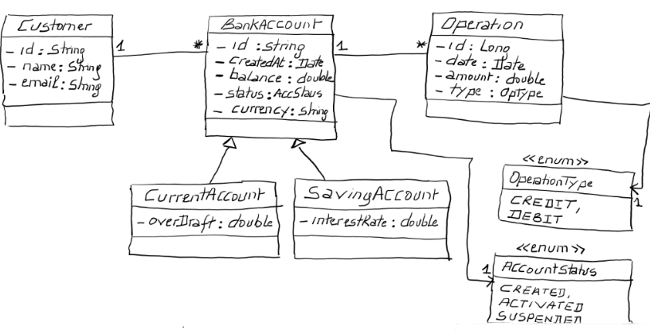

## Couch DAO

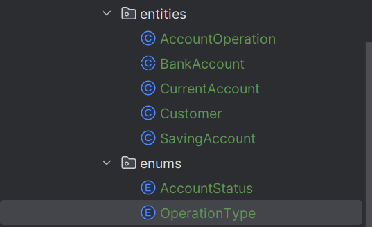
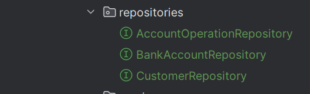

## Couch Service

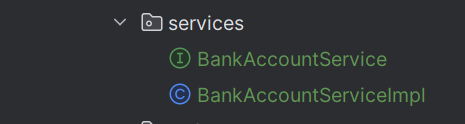

## Exceptions
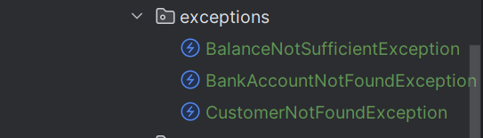

## Application Ebanking
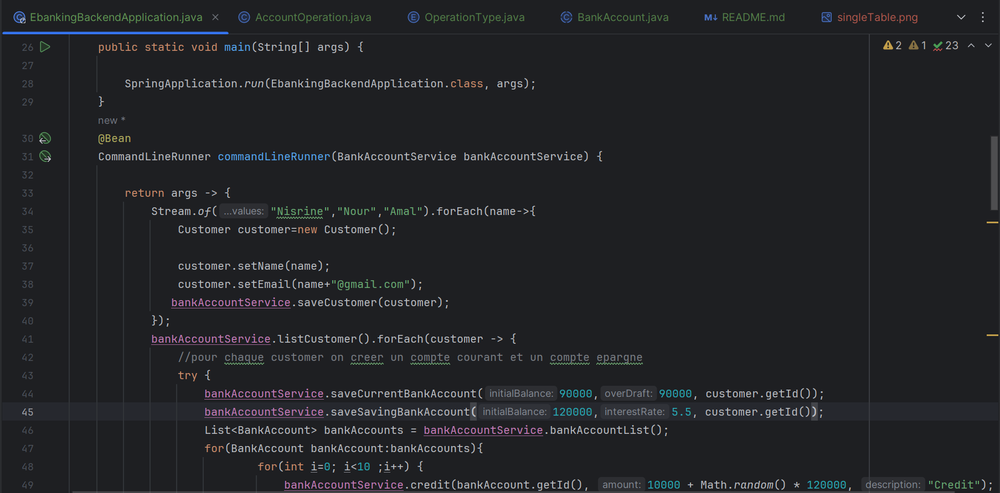
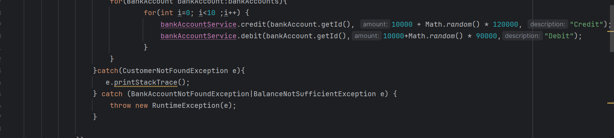

## Eager et Lazy

En Spring Data JPA, il existe deux stratégies de chargement des relations : eager et lazy.

- **Eager** : tous les éléments liés sont chargés dès que l'objet est chargé.
  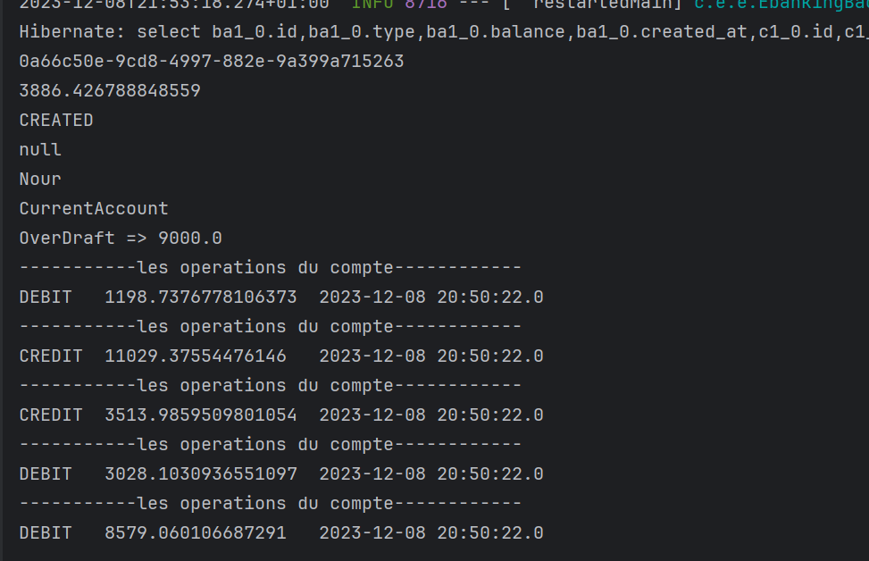
- **Lazy** : les éléments liés ne sont chargés que lorsqu'ils sont nécessaires. La stratégie de chargement par défaut est lazy.
  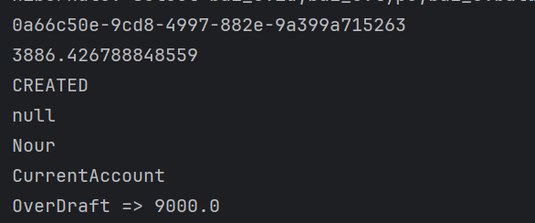

## Stratégies de Mapping Héritage

En Spring Data JPA, il existe trois stratégies de mapping héritage :

- **Single Table** : toutes les entités héritées sont mappées vers la même table.
  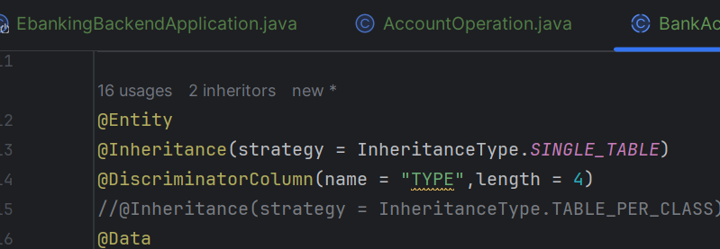

  → *Base de données*
  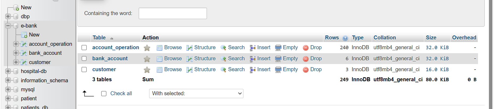
  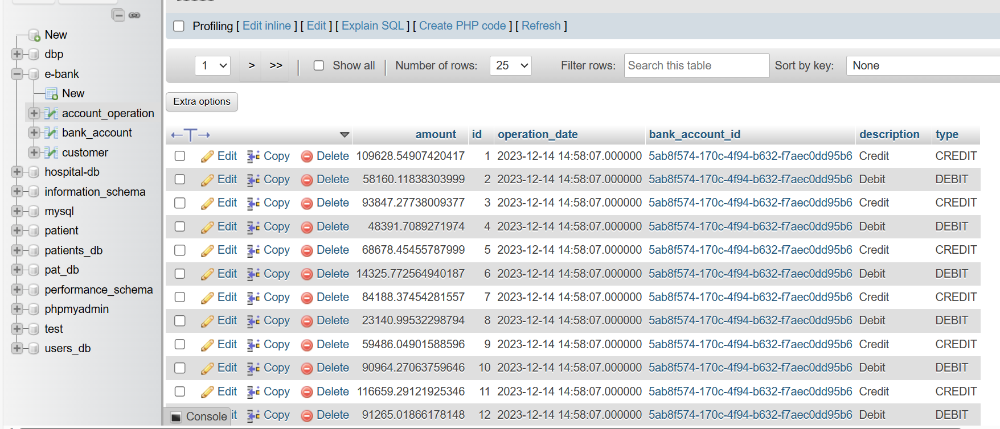
  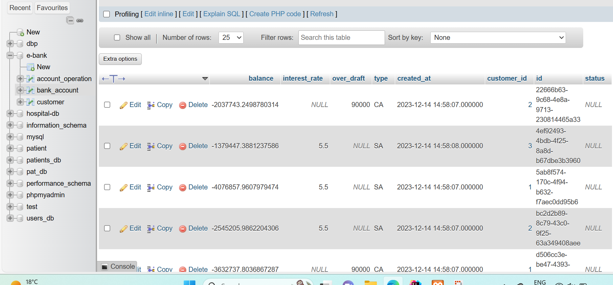
  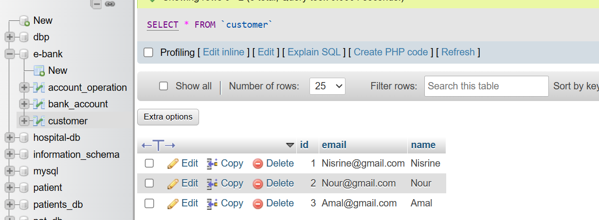
- **Table per Class** : chaque entité héritée est mappée vers sa propre table.
  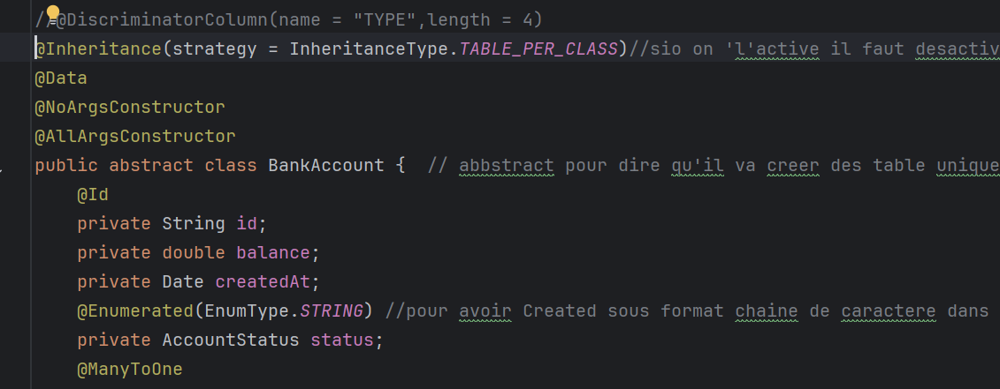
  → *Base de données*
   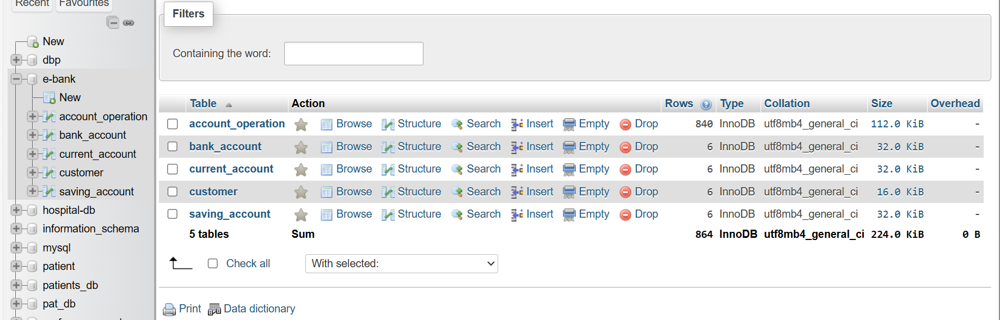
   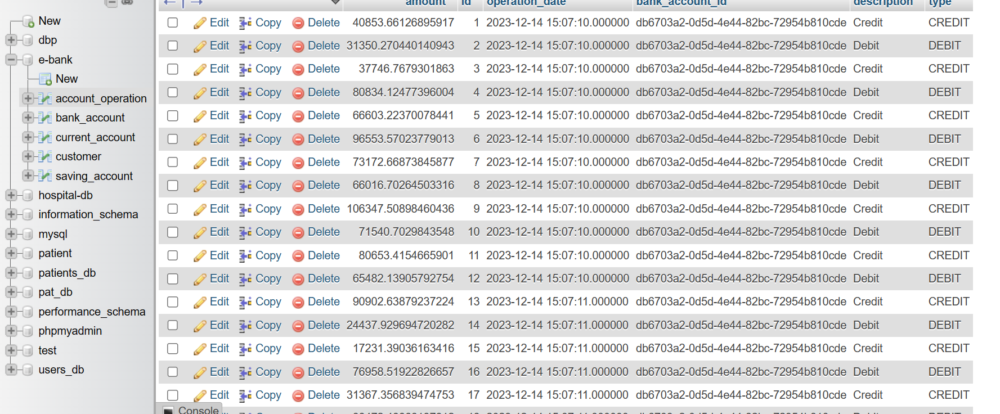
   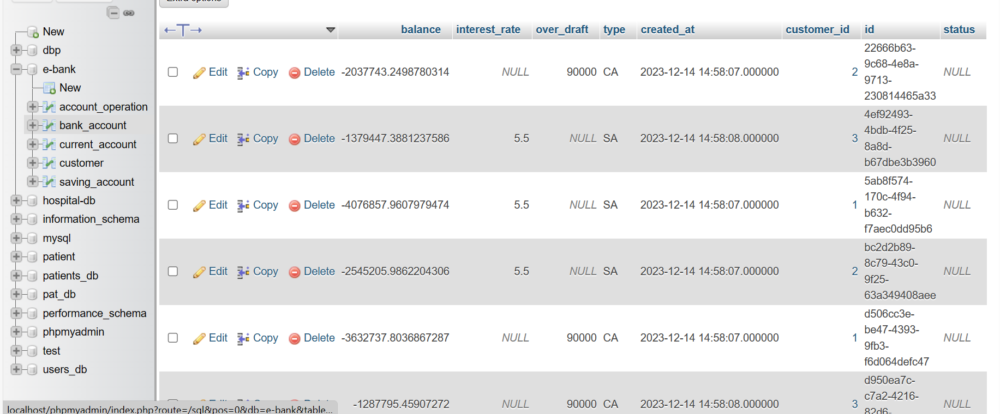
   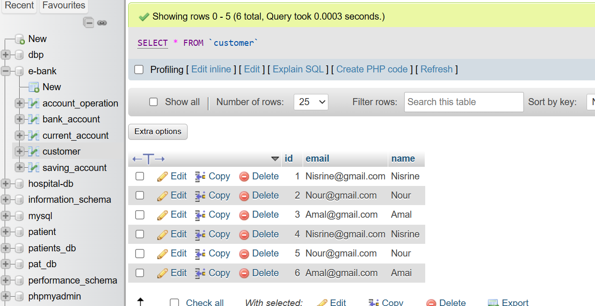
   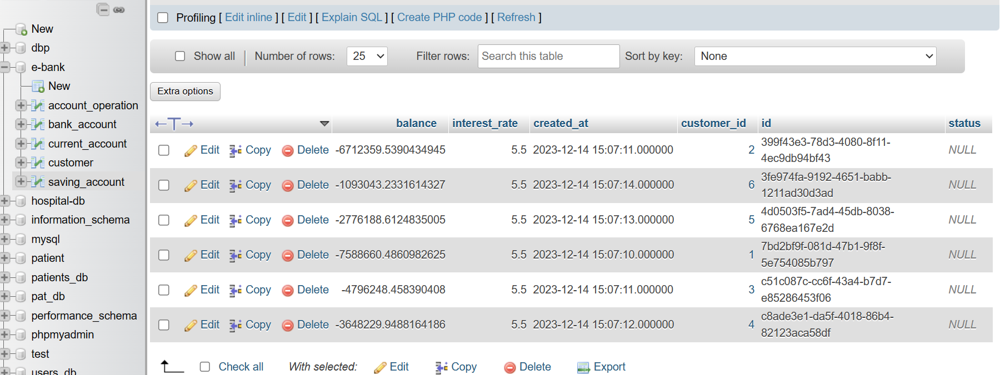
- **Joined Table** : une table de jointure est utilisée pour lier les tables des entités héritées. La stratégie de mapping par défaut est Single Table. 
  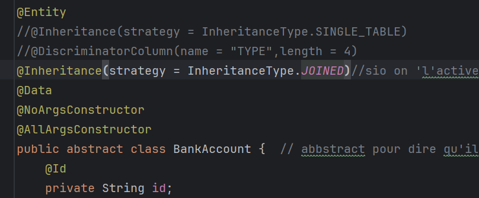

  → *Base de données*
  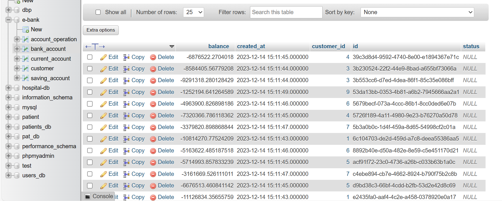
  
  
  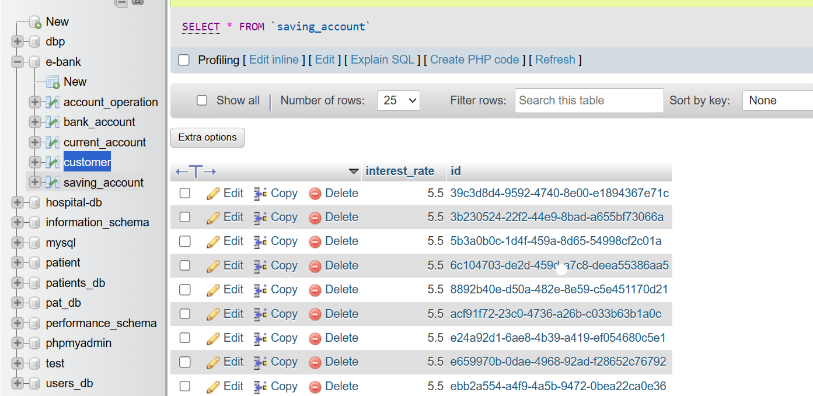

## Conclusion

Ce projet illustre l'utilisation de Spring Boot pour créer une application web RESTful avec un rendu HTML côté client, fonctionnant avec Maven. Il fournit également des exemples de l'utilisation de Couch DAO, Couch Service, Eager et Lazy, et des stratégies de mapping héritage.
