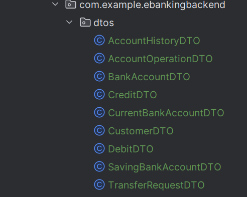
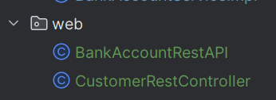
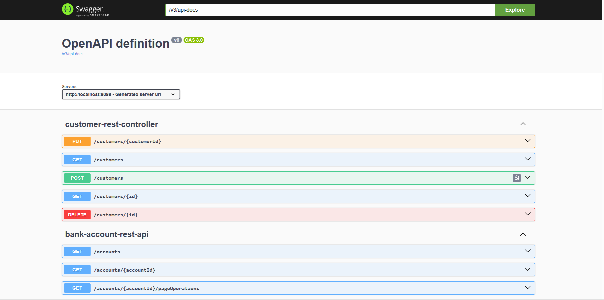
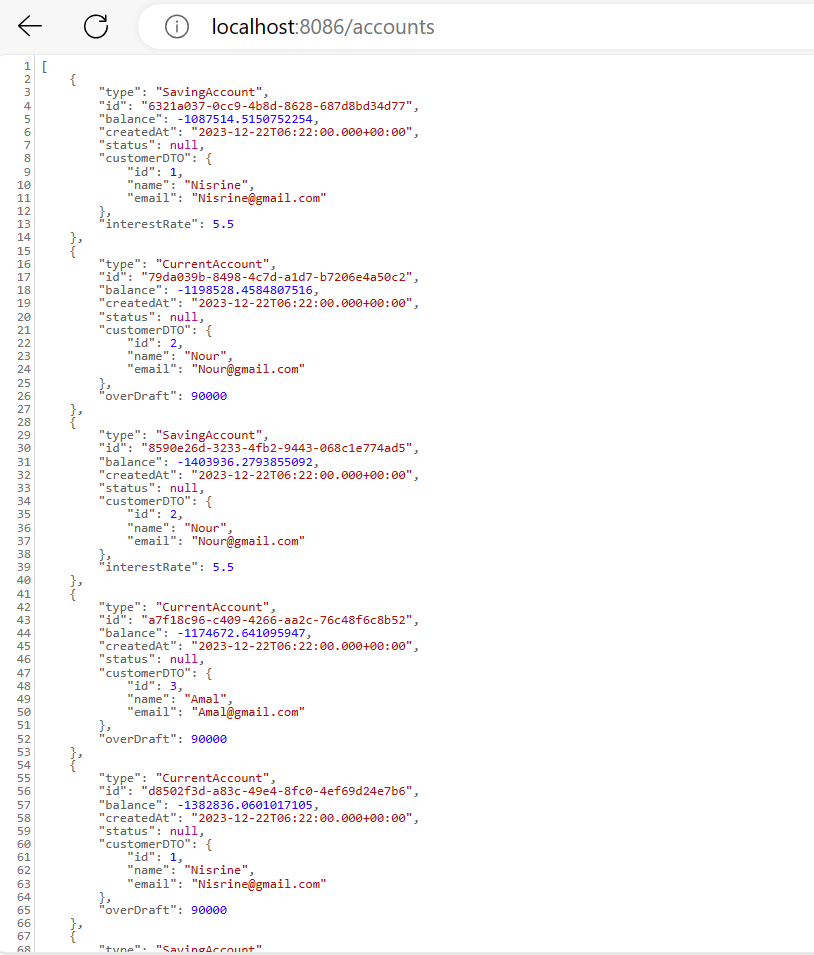
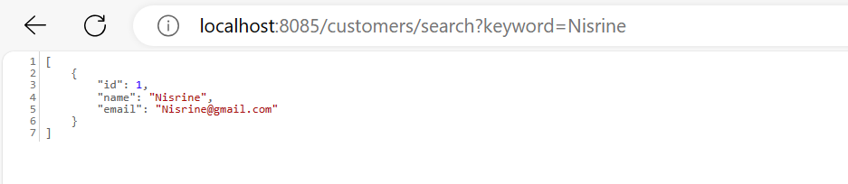
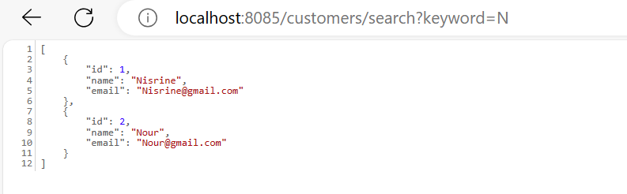
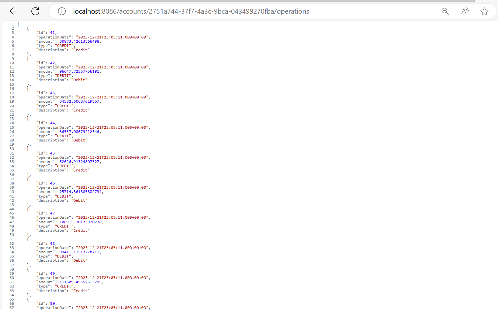
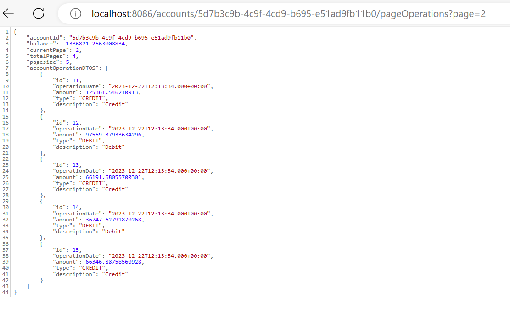

# Projet de Gestion de Comptes Bancaires avec Backend

## Introduction

Ce projet est un exemple d'utilisation de Spring Boot pour créer une application web RESTful, fonctionnant avec Maven.
Le projet a pour objectif de créer une application web avec un rendu HTML côté client. Les principales fonctionnalités incluent :

- Gérer les clients de la banque.
- Gérer les comptes bancaires appartenant à des clients.
- Gérer les opérations sur les comptes : versements, retraits, virements.

Cela permettra aux utilisateurs de bénéficier d'une interface conviviale pour interagir avec les fonctionnalités bancaires offertes par l'application.

## Enoncé

On souhaite créer une application qui permet de gérer des comptes bancaires. chaque compte appartient à un client. un compte peut subir plusieurs opérations de type DEBIT ou CREDIT. Il existe deux types de comptes : Comptes courants et comptes épargnes.

1. Créer un projet Spring Boot
2. Créer les entités JPA : Customer, BankAccount, Saving Account, CurrentAccount, AccountOperation
3. Créer les interfaces JPA Repository basées sur Spring Data
4. Tester la couche DAO
   5 Couche service, DTOs
6. RestController

## Conception

## Couch DAO

## Couch Service

## Couch DTOS

## Couch Web

## Exceptions

## Application Ebanking

## Eager et Lazy

En Spring Data JPA, il existe deux stratégies de chargement des relations : eager et lazy.

- **Eager** : tous les éléments liés sont chargés dès que l'objet est chargé.
  
  
  
- **Lazy** : les éléments liés ne sont chargés que lorsqu'ils sont nécessaires. La stratégie de chargement par défaut est lazy.
  
  

## Stratégies de Mapping Héritage

En Spring Data JPA, il existe trois stratégies de mapping héritage :

- **Single Table** : toutes les entités héritées sont mappées vers la même table.
  

  → *Base de données*
  
  
  
  
- **Table per Class** : chaque entité héritée est mappée vers sa propre table.
  
  → *Base de données*
  
  
  
  
  
- **Joined Table** : une table de jointure est utilisée pour lier les tables des entités héritées. La stratégie de mapping par défaut est Single Table.
  

  → *Base de données*
  
  
  
  

# BankAccountRestAPI

**Explications des Annotations:**

`@RestController` : Indique que cette classe est un contrôleur REST. Les méthodes de cette classe renvoient directement des données au format JSON.

`@CrossOrigin("*")` : Autorise les requêtes provenant de toutes les origines. Utile pour permettre l'accès aux services depuis différents domaines.

`@GetMapping` : Annotation pour mapper une requête HTTP GET sur une méthode spécifique.

`@PostMapping` : Annotation pour mapper une requête HTTP POST sur une méthode spécifique.

`@RequestBody` : Indique que le corps de la requête HTTP doit être converti en objet Java.

`@PathVariable` : Utilisé pour extraire des valeurs de variables de modèle dans l'URL.

`@RequestParam` : Utilisé pour extraire les paramètres de la requête.

`@Repository` : Annotation utilisée pour indiquer que cette classe est un composant de persistance (DAO).

## Méthodes du Contrôleur

`getBankAccount` : Obtient les détails d'un compte bancaire par son identifiant.

`listAccounts` : Renvoie la liste de tous les comptes bancaires.

`getHistory` : Renvoie l'historique des opérations d'un compte bancaire.

`getAccountHistory` : Renvoie l'historique paginé des opérations d'un compte bancaire.

`debit` : Effectue une opération de débit sur un compte bancaire.

`credit` : Effectue une opération de crédit sur un compte bancaire.

`transfer` : Effectue un transfert entre deux comptes bancaires.

# CustomerRestController

## Méthodes du Contrôleur

- `customers` : Renvoie une liste de tous les clients.
- `searchCustomers` : Renvoie une liste de clients en fonction d'un mot-clé fourni.
- `getCustomer` : Renvoie les détails d'un client spécifique par ID.
- `saveCustomer` : Enregistre un nouveau client.
- `updateCustomer` : Met à jour les détails du client par ID.
- `deleteCustomer` : Supprime un client par ID.

## Utilisation de Swagger UI

Swagger UI est une interface utilisateur interactive qui permet de visualiser et de tester les API REST

## Verification

- **Liste des comptes**
  

- **Chercher Client par son Prenom**
  

- **Chercher des Client dont le Prenom contient 'chaines de caracteres'**
  

- **Les operations effectues par un client quelconque**
  

- **Pagination pour les operations**
  

## Conclusion

Ce projet illustre l'utilisation de Spring Boot pour créer une application web RESTful avec un rendu HTML côté client, fonctionnant avec Maven. Il fournit également des exemples de l'utilisation de Couch DAO, Couch Service, Eager et Lazy, et des stratégies de mapping héritage.
